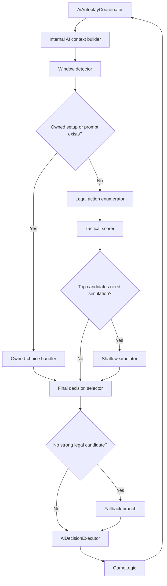
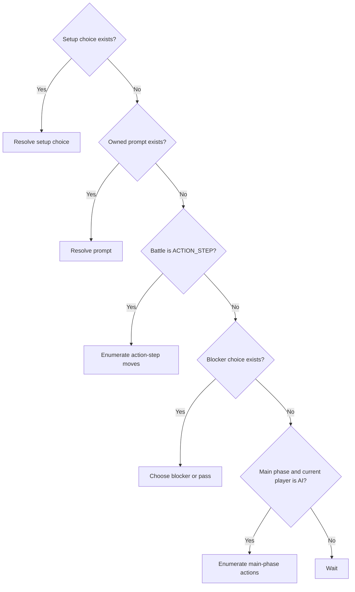

# V1 Computer Opponent Protocol

## Purpose

This document describes how the v1 computer opponent should work before implementation starts.
It defines the runtime flow, decision protocol, and build subtasks for the first playable bot in this backend.

This document sits between the high-level computer-opponent plan and the actual code work.
It should be detailed enough that an implementer can follow it without inventing the core runtime design.

## Design Goals

- choose only legal moves
- finish full matches without getting stuck
- respect hidden information in live play
- resolve all bot-owned prompts reliably
- make sensible main-phase, blocker, battle, and burst decisions
- stay compatible with the current backend execution path

## Runtime Boundaries

- live decision logic stays in the TypeScript backend
- reuse `GameLogic`, `AiDecisionExecutor`, and the current action and choice confirmation APIs
- do not use live LLM calls in v1
- do not use Python in the live move loop in v1
- do not bypass the normal rule engine to make a move happen

## Existing Components To Reuse

The v1 protocol should build on these existing components:

- `GameAiService`
- `AiAutoplayCoordinator`
- `AiDecisionExecutor`
- `GameEnvViewBuilder`
- `GameLogic`

The current bot already has a working autoplay loop and executor boundary.
The v1 work should replace the decision logic inside that path, not replace the whole runtime.

## Core Protocol

The runtime protocol for one bot decision should be:

1. `AiAutoplayCoordinator` loads the latest `GameEnvironment`.
2. Build an internal fair AI decision context from the live game state.
3. Detect the current runtime window.
4. If there is an owned setup or choice event, resolve that first.
5. Otherwise enumerate legal actions for the current window.
6. Score those candidates with tactical rules.
7. If the window is worth deeper checking, shallow-simulate the top candidates.
8. Select the final candidate.
9. Map it back into the existing `AiDecision` shape.
10. Execute it through `AiDecisionExecutor`.
11. Let `GameLogic` process the action and update the game state.
12. Return to the autoplay loop and repeat until the bot should wait.

### Runtime Flow Diagram

## Window Protocol

The bot must be window-aware.
It must not act like a simple script that always tries to play a card, then attack, then end turn.

### Window Handling Rules

- `setup`
  - handle first-player choice and redraw confirmation before normal gameplay
- `owned prompt`
  - if the bot owns a burst, target, blocker, token, option, or prompt choice, resolve it before all other actions
- `battle ACTION_STEP`
  - enumerate battle tricks, activated effects, and pass/confirm choices
- `blocker step`
  - choose whether to block and which blocker to use
- `main phase`
  - enumerate legal plays, abilities, attacks, and end turn
- `battle confirm / resolve`
  - confirm or resolve battle only after owned prompts and stronger legal reactions are handled
- `wait`
  - if none of the above windows give the bot a legal owned action, return `wait`

### Window Protocol Diagram

## Candidate Evaluation Rules

The v1 bot should not pretend to be a deep general search system.
Its first job is to make good match-play decisions using reliable tactical rules.

### Priority Rules

- always take immediate lethal
- stop immediate loss before greedy value plays
- resolve mandatory owned prompts first
- do not attack shields blindly into high burst risk
- prefer profitable unit attacks over random shield attacks
- value `High-Maneuver`, `First Strike`, `Suppression`, `Breach`, `Blocker`, and `Repair` as first-class tactical signals
- in main phase, prefer deploy, pair, and command lines that create immediate board or combat value
- avoid obvious overextension when crackback risk is high

### Tactical Score Signals

The first scoring layer should look at:

- lethal pressure
- anti-lethal defense
- board control
- combat access
- shield race pressure
- burst pressure and burst exposure
- crackback risk
- deploy tempo
- pairing tempo
- action-step leverage
- blocker posture
- resilience

### Card References For Scoring

Use real card behavior to anchor the tactical logic:

- `GD01-008 Guntank` for deploy tempo and immediate damage
- `GD01-019 Byarlant Custom` for blocker posture
- `GD01-025 Gundam Deathscythe` for pair-to-combat swing and `First Strike`
- `GD01-027 Big Zam` for `Breach` and shield-race pressure
- `GD01-042 Duo's Leo` for attack access to active targets
- `GD01-091 Chang Wufei` for battle-damage prevention value
- `GD01-123 Nahel Argama` for burst swing risk
- `ST01-010 Amuro Ray` for burst-to-hand and pairing swing
- `ST01-014 Unforeseen Incident` for action-step AP swing
- `ST01-015 White Base` for token-based board development
- `GD02-001 Psycho Gundam` for shield pressure and follow-up value

## Simulation Rules

Simulation is a support tool in v1, not the whole system.
It should only improve the best few candidates after tactical scoring.

Rules:

- simulate only the top candidates, not the whole action space
- use cloned in-memory state only
- use the same rule path as live execution
- do not write to game files during simulation
- stop early if the budget is gone
- if simulation fails, fall back to tactical scoring and legal fallback behavior

### First Simulation Targets

Start simulation on these decision types first:

- attack target choice
- attack order
- shield-vs-unit attack choice
- whether to make one more main-phase play before combat
- whether to use or pass during battle `ACTION_STEP`

## Subtasks

The implementation should be split into these subtasks in this order.

### 1. Internal AI Decision Context

Goal:
- build a fair internal bot view from `GameEnvironment`

Must include:
- queue
- battle state
- hand
- slots
- base
- energy
- shield count
- trash
- derived combat facts

Output:
- `AiDecisionContext`

Dependency:
- none

### 2. Window Detector

Goal:
- map the live game state into one runtime window kind

Output:
- `AiWindowKind`

Dependency:
- `AiDecisionContext`

### 3. Owned Choice Resolver

Goal:
- support burst, target, blocker, token, option, and prompt choices

Output:
- stable prompt-first decision branch

Dependency:
- `AiDecisionContext`
- `AiWindowKind`

### 4. Legal Action Enumerator

Goal:
- return all bot-owned legal actions for the current window

Output:
- internal `AiActionCandidate[]`

Dependency:
- `AiDecisionContext`
- `AiWindowKind`

### 5. Tactical Scoring Layer

Goal:
- score candidates with simple match-play rules

Must prioritize:
- lethal
- anti-lethal
- AP swing
- board control
- attack access
- burst risk
- crackback risk

Dependency:
- legal action enumerator

### 6. Card-Family Scoring Support

Goal:
- cover the major effect families already dominant in the live pool

Required effect families:
- `sequence`
- `conditional`
- `damage`
- `damageShield`
- `modifyAP`
- `deploy`
- `rest`
- `designate_pilot`
- `redirect_attack`
- `grant_keyword`
- `returnToHand`
- `allow_attack_target`
- `prevent_battle_damage`

Dependency:
- tactical scoring layer

### 7. Shallow Simulation Layer

Goal:
- simulate top candidates only

Focus first on:
- attack target
- attack order
- one-more-play-before-combat
- action-step pass or use decisions

Dependency:
- legal action enumerator
- tactical scoring layer

### 8. Decision Mapping Layer

Goal:
- convert the chosen internal candidate back into existing `AiDecision` shapes

Must preserve:
- executor compatibility
- current live action and confirm APIs

Dependency:
- candidate selection

### 9. Telemetry And Debug Output

Goal:
- make decisions explainable and measurable

Must record:
- chosen reason
- top candidate list
- tactical score
- simulation score
- fallback usage
- latency

Dependency:
- full pipeline

## Acceptance Criteria

Before code implementation is considered complete, the protocol should support all of the following:

- the bot can finish full matches without waiting for manual input
- the bot resolves all owned prompt types
- the bot uses only fair hidden-information data
- main phase chooses among play, ability, attack, and end-turn actions
- blocker step makes a real blocker or pass choice
- battle `ACTION_STEP` can use battle tricks instead of auto-confirming
- shield-vs-unit attack choice is tactical, not random
- burst-related decisions reflect actual burst swing risk
- shallow simulation matches real engine behavior for chosen candidate types

## Risks

- building the bot on a frontend-only player view may hide prompt data the bot needs
- if prompt ownership is wrong, the bot may stall or respond out of turn
- if window detection is weak, the bot will make legal but low-quality choices
- if tactical scoring ignores burst and action-step timing, the bot will feel reckless
- if simulation is added before enumeration and prompt handling are stable, debugging will become harder
- if fallback behavior is not deterministic, bugs will be difficult to reproduce
